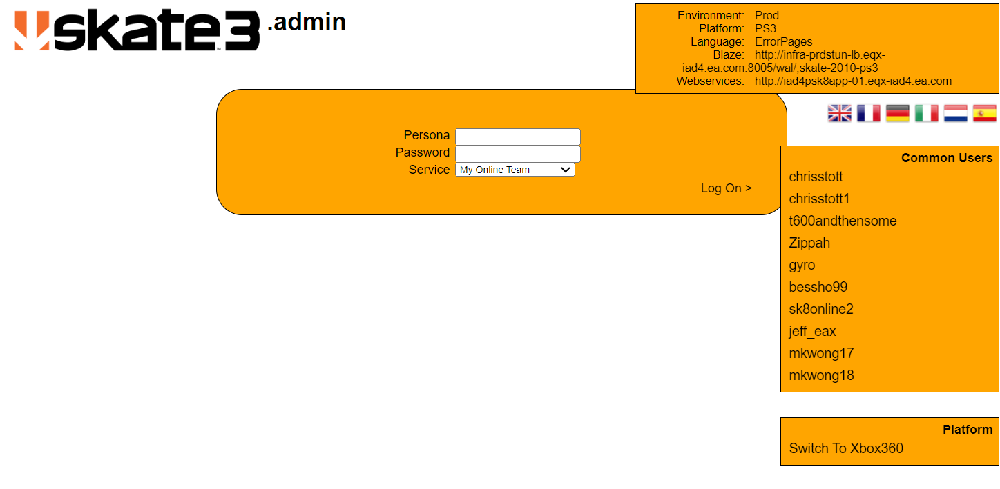

# **Routes and their purposes**

### Unknown (http://downloads.skate.online.ea.com/skate3/webkit/PS3/ErrorPages/404/Sessions/LogOn)

incase this somehow disappears I made a screenshot for it.

As mentioned below in (404), this route is actually unauthorized, meaning that you can fake the page into 
loading the view for authorized pages but without correct authentication you can't do anything with it.

### Debug (/debug)
Not a real route, but can used as virtually a web interface, you can practically put what you want here,
you can make a web interface which can config and monitor the project but you should consider delegating this.

<ul>
<li><i>/status</i> Returns the start time of the process, nothing else for now.</li>
</ul>

### Config (/skate3/config)
both written as <i>/PS3.xml</i> and <i>/XBL2.xml</i> stating their config settings for each platform with each variable being able to be changed.
these are accessed when you login into the server, you can easily view the json structure below
 [PS3](http://downloads.skate.online.ea.com/skate3/config/PS3.xml) [Xbox (XBL2)](http://downloads.skate.online.ea.com/skate3/config/XBL2.xml)

## **Webkit**
Below are routes which are directly related to the browser functions of Skate 3

### 404 (/skate3/webkit/PS3/ErrorPages/404)

The 404 page, automatically redirects whenever the service can't be viewed, denied due to no authorization or doesn't exist.
Doesn't have auth which seemed to be the attack vector which allowed me to get to the 'admin' page shown above 
unless it was supposed to be that way.

### Leaderboards (/skate3/webkit/PS3/English/i/Leaderboards)

Ranking of all accounts available set in 3 different filters shown below

<ul>
  <li><i>/Solo</i></li>
  <li><i>/Solo/Overall</i></li>
  <li><i>/Solo/Ranked</i></li>
</ul>

###     Sessions (/skate3/webkit/PS3/English/i/Sessions)

###     Skatefeed (/skate3/webkit/PS3/English/i/SkateFeed)

###     Teams (/skate3/webkit/PS3/English/i/Teams)

###     Test (/skate3/webkit/PS3/English/i/Test)

###     Users (/skate3/webkit/PS3/English/i/Users)

## **Services**
Below are routes which lead to services, designed to get and put information (ex. team creation, login, etc..)

#### Skatefeed (/skate3/ws/SkateFeed.asmx)

#### Skateprofile (/skate3/ws/SkateProfile.asmx)

#### Skateteam (/skate3/ws/SkateTeam.asmx)