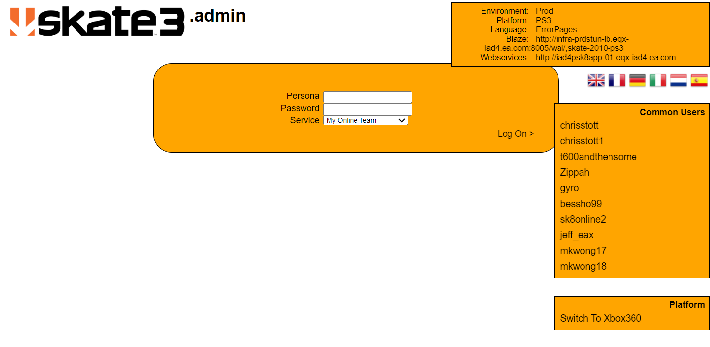

### Unknown (http://downloads.skate.online.ea.com/skate3/webkit/PS3/ErrorPages/404/Sessions/LogOn)

incase this somehow disappears I made a screenshot for it.

As mentioned below in (404), this route is actually unauthorized, meaning that you can fake the page into 
loading the view for authorized pages but without correct authentication you can't do anything with it.
